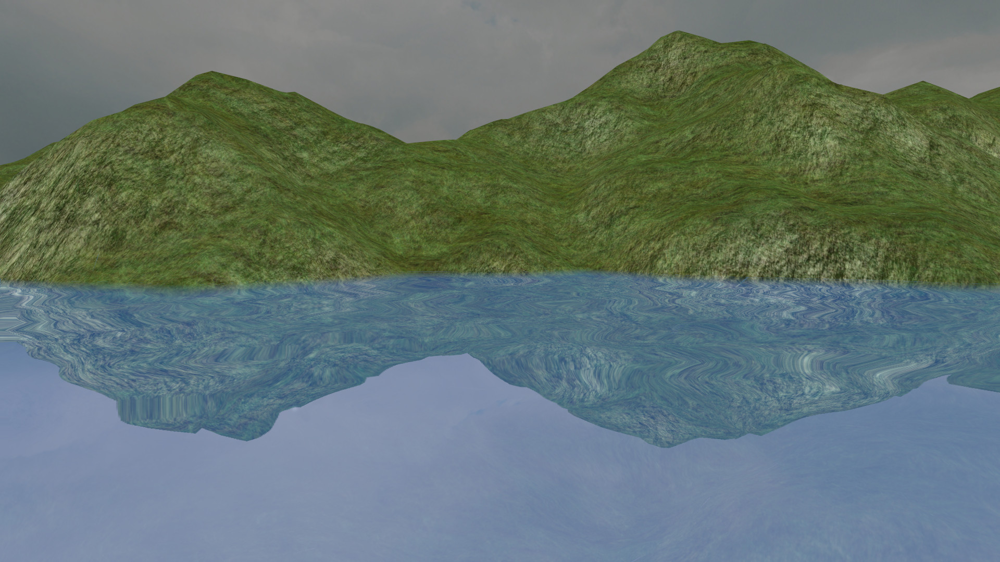
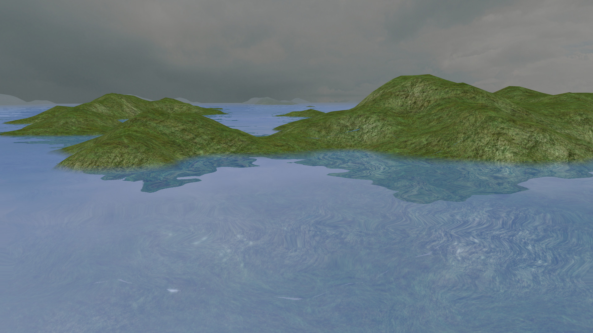
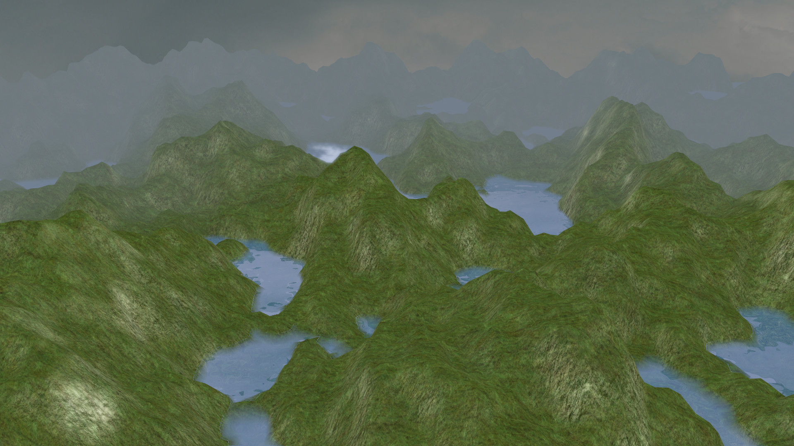
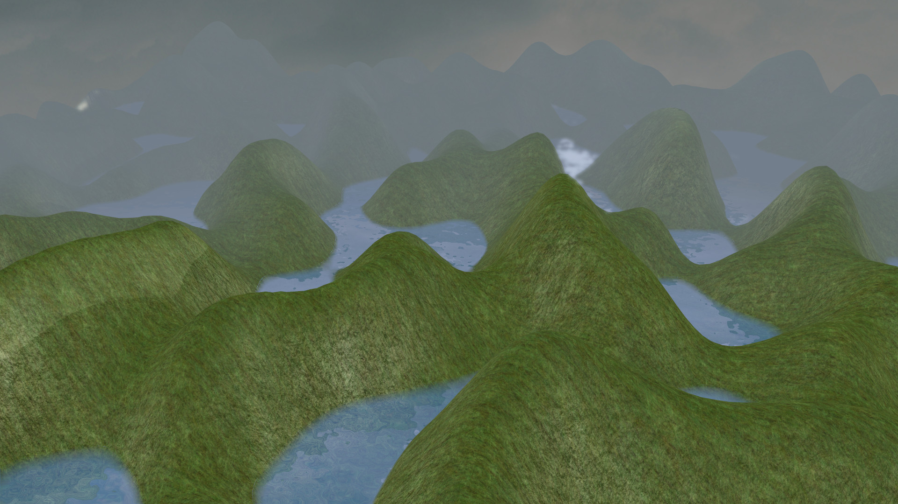
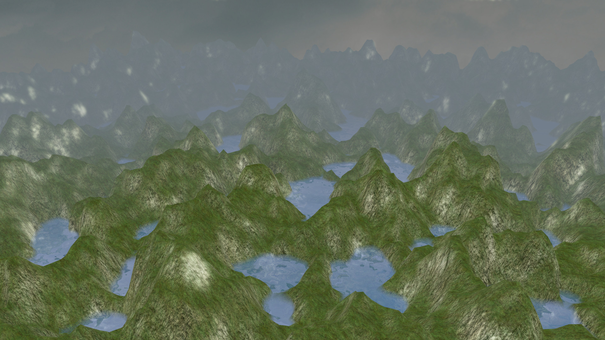
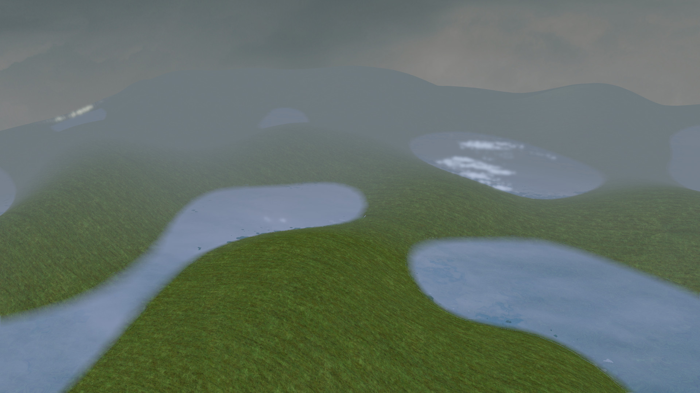
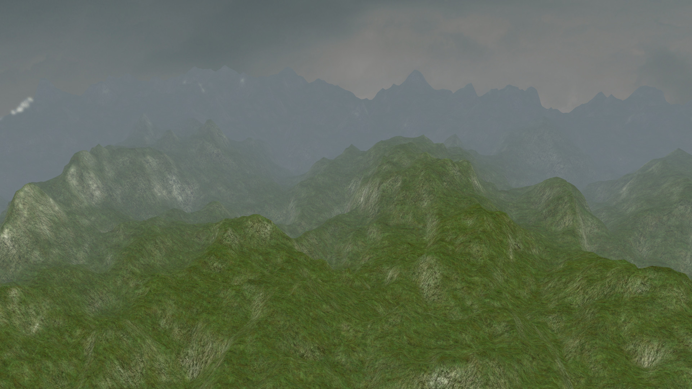
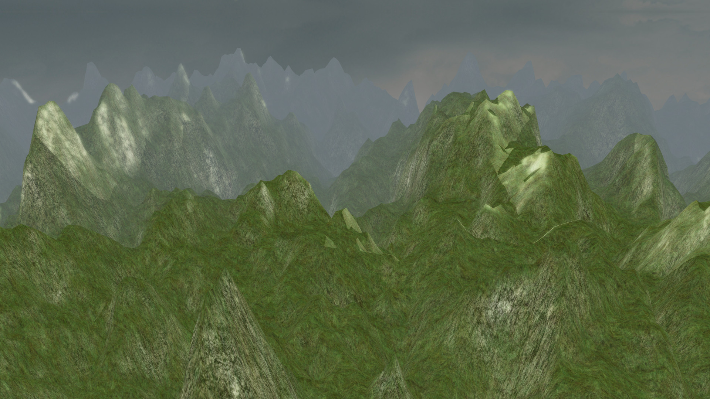
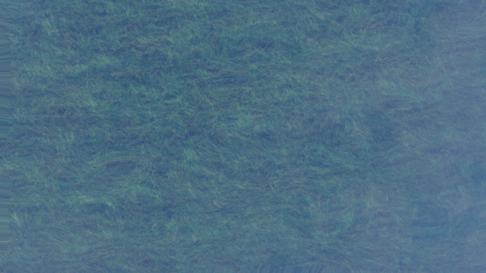
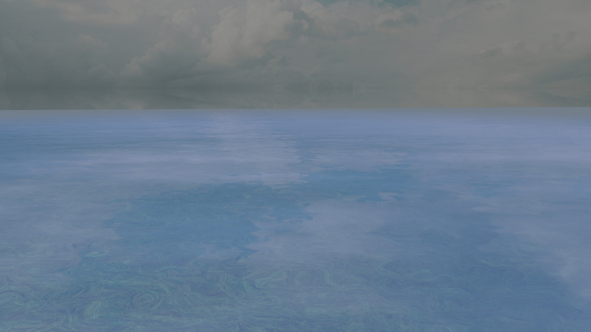

# 3D Terrain Generation with Perlin Noise

A real-time 3D terrain generator using OpenGL 4.1 and C++. The project uses Perlin noise to create realistic landscapes with features like mountains, valleys, and water bodies. It includes a dynamic camera system for terrain exploration and various visual effects.



## Features

- Real-time 3D terrain generation using Perlin noise
- Dynamic Level of Detail (LOD) using tessellation
- Water rendering with reflections and refractions
- Normal map generation for enhanced lighting
- Interactive camera system
- Multiple terrain generation methods
- Adjustable terrain parameters

## Prerequisites

- Windows 10 or later
- Graphics card supporting OpenGL 4.1 or higher
- Updated graphics card drivers
- CMake 3.10 or higher
- MinGW-w64 with G++ compiler

Tested on:
- RX 480
- GTX 650 ti

## Dependencies Installation

1. **MinGW-w64**:
   - Download MinGW-w64 from [MinGW-w64 Website](https://www.mingw-w64.org/)
   - Install with settings: x86_64 architecture, win32 threads, SJLJ exceptions
   - Add MinGW-w64 bin directory to system PATH

2. **CMake**:
   - Download and install CMake from [CMake Website](https://cmake.org/download/)
   - Ensure to add CMake to system PATH during installation

3. **Required Libraries** (included in the project):
   - GLFW (Window management)
   - GLM (Mathematics)
   - GLEW (OpenGL extension loading)
   - stb_image (Image loading)
   - FreeType (Font rendering)

## Building the Project

1. Clone the repository:
   ```bash
   git clone https://github.com/yourusername/3D-terrain-generation.git
   cd 3D-terrain-generation
   ```

2. Build the project:
   - Double-click `comp.bat`, or
   - Run from command line:
     ```bash
     .\comp.bat
     ```
   - The script will:
     - Create a build directory
     - Configure CMake
     - Build the project
     - Place executable and resources in the build folder

3. Run the project:
   - Navigate to the build directory
   - Run `terrain.exe`

## Controls

```
Mouse - Camera rotation
WASD  - Movement
P     - Toggle polygon mode
O     - Toggle object mode (disable polygon mode)
Y     - Increase tessellation level
T     - Decrease tessellation level
C     - Enable shadows
Z     - Disable shadows
N     - Enable water
M     - Disable water
1-0   - Switch between terrain generation methods
=     - Increase terrain height
-     - Decrease terrain height
ESC   - Exit application
```

## Technical Details

### Terrain Generation
The terrain is generated using Perlin noise to create a heightmap, which is then stored in a 2D texture. The same data is used to generate a normal map using the Sobel operator for realistic lighting calculations.

### Tessellation
The project uses OpenGL 4.0's tessellation feature for dynamic Level of Detail (LOD). The tessellation level is adjusted based on the distance between the camera and the terrain surface, optimizing performance while maintaining visual quality.

### Water Rendering
Water effects are achieved through:
- DuDv mapping for water movement
- Normal mapping for light calculations
- Reflection and refraction using framebuffers
- Custom shaders for realistic water appearance

### Screenshots:










## Future Development Plans

- Enhanced terrain features (caves, overhangs)
- Vegetation system
- Weather effects
- Day/night cycle
- Terrain texturing based on height and slope
- Erosion simulation

## Contributing

Feel free to open issues or submit pull requests for improvements and bug fixes.

## License

This project is licensed under the MIT License - see the [LICENSE](LICENSE) file for details.


